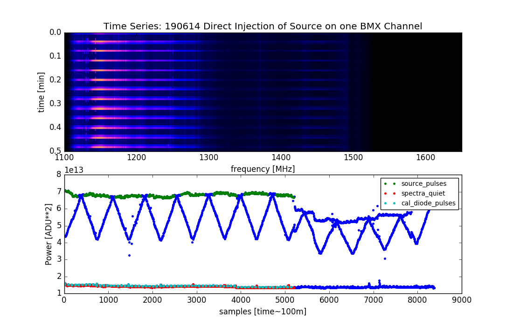
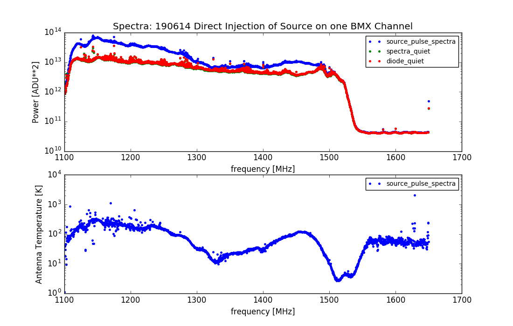
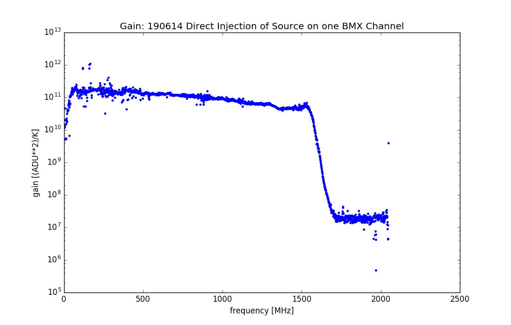
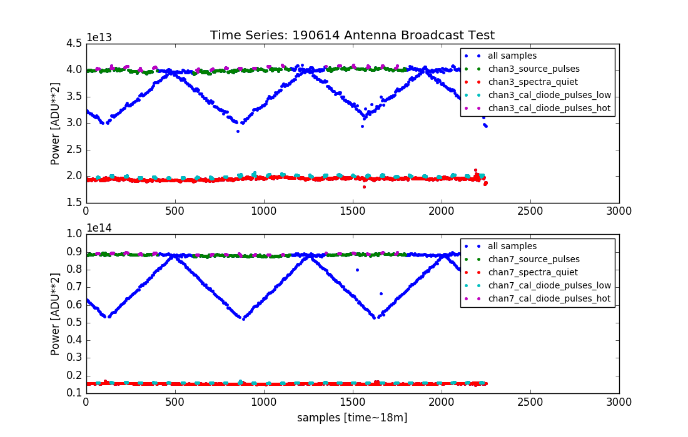
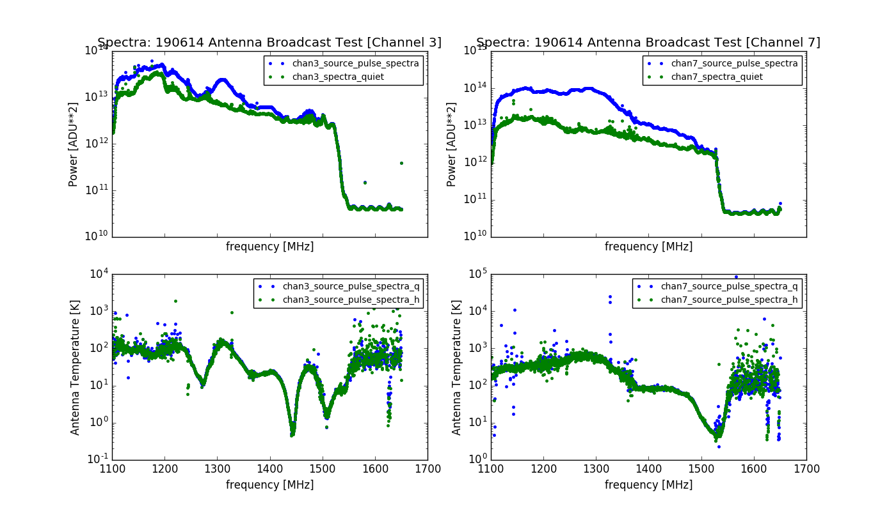
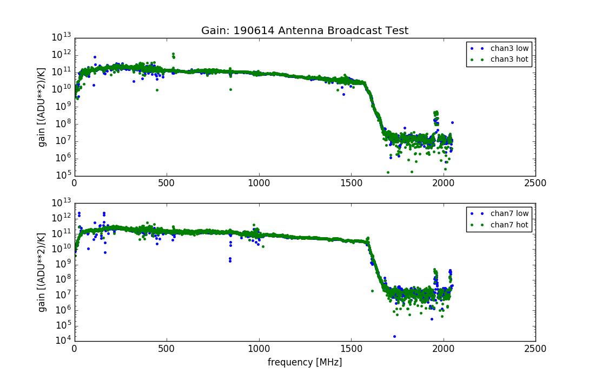

## BMX Measurements of Noise Source

Way back in June, Anze and I performed some tests of the noise source, as seen by BMX. We performed tests by directly connecting the noise source to the BMX amplifier chains (a process I henceforth refer to as 'direct injection') and broadcast them from the base of one BMX dish through the bicolog antenna that operates in the BMX frequency band. If you are interested in looking at the data, or reproducing these plots, please have a look at this [Python Code.](190614_Noise_Source_Analysis.py)		
### Direct Injection Tests:

We begin by collecting ~40 minutes of data with BMX with the noise source directly connected to a BMX feed. That data is shown in the top panel of figure one, with time on the Y-axis and frequency on the X-axis. This waterfall plot is zoomed in, and shows the wide frequency range of the noise source as bright horizontal bands:

**Figure 1: Direct Injection Time Series**

In the bottom panel, we see power as a function of time for a specific frequency bin where the noise source is brightest. I have sliced the waterfall plots to isolate regions where the source is on (green) and off (red) appear over all times (blue). In cyan, BMX calibration diode pulses are shown while the source is off, for purposes of calibrating this data into absolute units of Antenna Temperature (K).

**Figure 2: Direct Injection Spectra**

Next we average the spectra for the source on and source off segments discussed in the previous section. The top panel shows the uncalibrated source on (blue) source off (green, behind red) and calibration diode on (red) spectra. In the bottom panel, the calibrated source signal is shown, obtained from the difference of the average on and off spectra.

**Figure 3: Direct Injection Gain**

This is the gain array for the direct injection test, calculated from the noise diode calibration pulse ENR equation, which appears in the python code but I can't for the life of me remember right now.

### Antenna Broadcast Tests:

Next, we collected several minutes of data with the noise source on the bicolog antenna. A plot similar to figure one is shown here, for the two BMX channels on which the data is immediately visible by eye. These two channels are the two polarizations for the dish upon which the antenna was placed.

**Figure 4: Antenna Broadcast Time Series**

In this plot, I show that I can isolate the source on (green) and source off (red) spectra from the calibration pulse spectra (cyan, purple). I also omit a large portion of the data (blue) where the source is partially on during the data acquisition time period.

**Figure 5: Antenna Broadcast Spectra**

The top panel are the source on and source off uncalibrated spectra on the two BMX data channels. The bottom panel shows source on minus source off spectra, calibrated (K) with two gain calculations discussed in the next plot. This is equivalent to the emission from the noise source, as measured by BMX.

**Figure 6: Antenna Broadcast Gain**

This figure shows the gain arrays for both channels, calculated for the calibration pulses when the source is on and off. The gain arrays are qualitatively quite similar, and indicate that the gain does not change in the presence of the noise source turning on and off.
