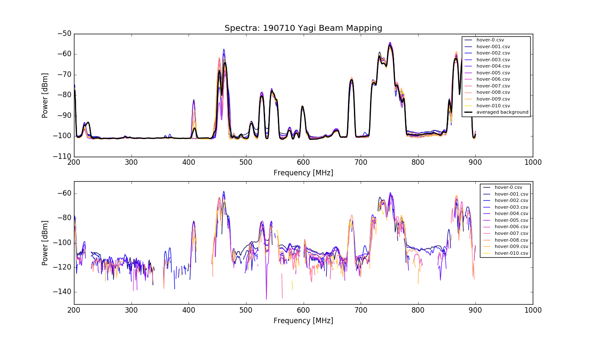
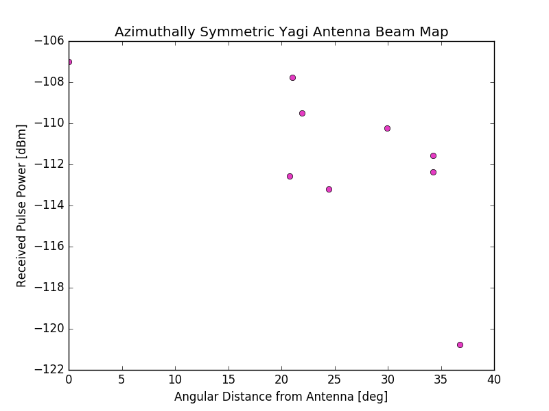

## Yagi Antenna Map

In July we (rather crudely) attempted to map the Yagi Antenna beam using the drone, noise source, and the spectrum analyzer. The test from July 10th was less successful, so I will only include two figures from this endeavor.
The [Python code](190710_Yagi_Map_Test.py) used to analyze the spectra, drone/RTK data, and more are available at this link.

The first figure is the spectra acquired with the drone flying over various positions:

**Figure 1: Drone Flight Spectra**

In the top panel, the colored curves are the measured spectra from the drone flying above the yagi, at various recorded positions. In black the background spectra is shown, acquired while the drone and source were powered off. Due to varying RFI background conditions, the background spectra is actually higher than the drone+source spectra at many frequencies, which leads to some trouble in the bottom panel, where negative numbers NAN when plotted on a log scale.

From these data, we average/coadd the measured dBm values over a frequency range, and plot the received power from the drone source as a function of angular distance from the Yagi.

**Figure 2: Very Sad Beam Map**

These methods were improved in a later attempt at beam mapping, which we performed the following day.
