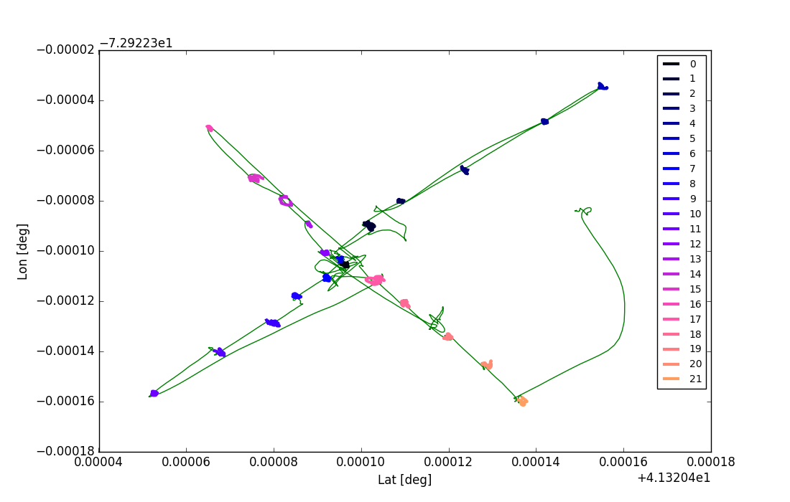
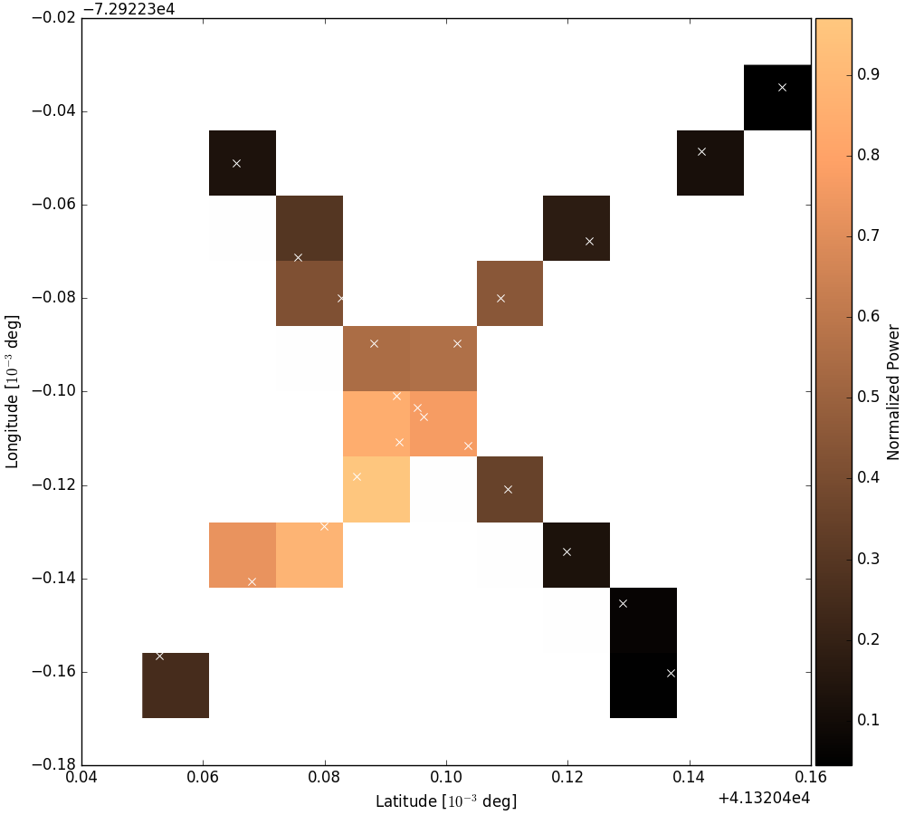

## Yagi Antenna Beammap Part 2: Electric Boogaloo

On July 11th, we performed a second and far more successful drone flight test in which we mapped the beam of the small Yagi Antenna. We acquired two spectra at roughly 20 points above the Yagi, and acquired several background spectra for improved S/N. I wrote this [Python code](190711_Yagi_Map_Test.py) to produce these plots. (And many other, better, more interesting plots, which I haven't included in this posting...)

**Figure 1: Drone Flight Map**

This plot shows the 20 or so points above the antenna where we acquired spectra, for the purposes of mapping the beam. We elected to take two orthogonal slices through the antenna beam at low altitude, in order to have reasonably good control of the drones position while flying manually. Points where the drone hovered while spectra were acquired have been highlighted in vibrant colors, against the green background of all drone GPS data.

**Figure 2: Beammap of Yagi Antenna**

For each location above, two spectra were averaged, and the background spectrum was subtracted. This noise source spectra was coadded over a frequency range where the measured noise source signal was consistently visible above the background power. These were then normalized to the highest measured power, in the brightest square in the beammap. The ratio of these powers to the highest measured power defines the colorscale of the beammap, which (while modest in resolution and sampling) matches our expectations. The axes are thousandths of a degree in latitude and longitude, which were sadly more convenient to obtain than they are to interpret. White x characters denote the locations plotted in the map above.
